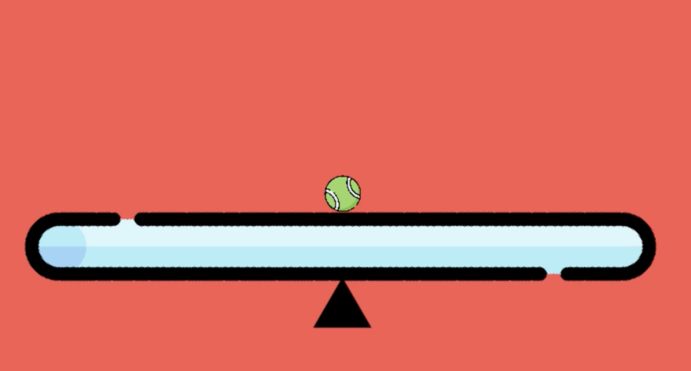
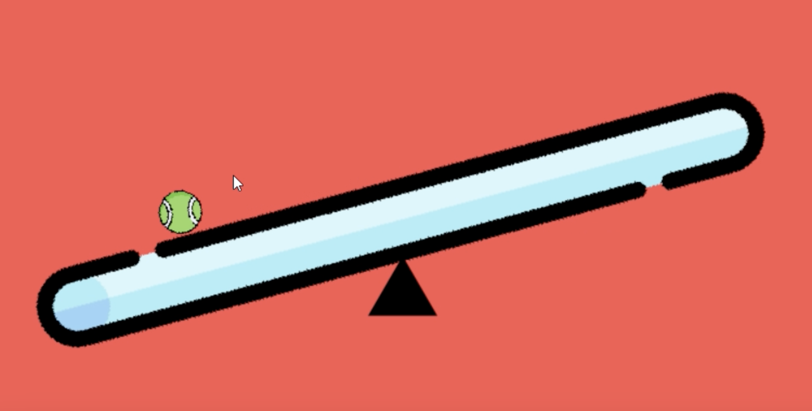
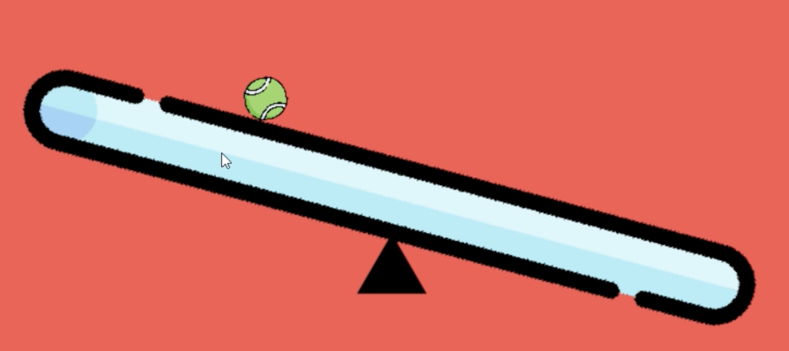

# Ball-on-a-Plate
I have designed the control solution for ball on a plate control system problem in **Python**.
It makes use of the **scipy.integrate** utility from the **scipy** library and **pygame** which is a  cross-platform set of Python modules used for writing video games. 
## Author - Omkar Nitsure
Email - omkarnitsure2003@gmail.com  
github profile - https://github.com/omkarnitsureiitb  

The game starts when a user using his **mouse** clicks on a particular position on the screen to initially set the ball in motion.
Then the controller that I designed uses various **triggers** on both sides of the plate to control the motion of the ball
untill it finally settles on the plate.  

## Demonstration
You can watch the video demonstration of the **controller in action**  <a href="Ball on a plate video.mp4">here</a>  

Following are the images which displays how the motion happens -  

